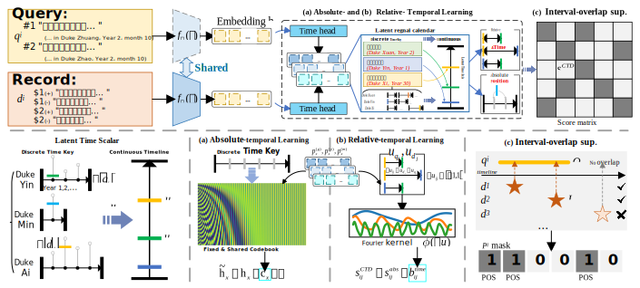

# ChunQiuTR

<p align="center">
  <b>ChunQiuTR: Time-Keyed Temporal Retrieval in Classical Chinese Annals</b><br>
  [Conference / Workshop / Preprint, Year]
</p>

<p align="center">
  <a href="[paper link]">Paper</a> ·
  <a href="[arxiv link]">arXiv</a> ·
  <a href="[dataset link]">Dataset</a> ·
  <a href="[https://pan.baidu.com/s/1LzL8CNCuHy7S0hxkjxoXnw?pwd=ryg3]">Checkpoint-BERT</a>·
  <a href="[https://pan.baidu.com/s/1yVl_xWR8zMljSXMoRJxBNg?pwd=c4y6]">Checkpoint-Qwen3</a>
</p>

## 1. Overview

This repository contains the official code and benchmark release for **ChunQiuTR**, a time-keyed retrieval benchmark for Classical Chinese annals and their commentarial tradition. Unlike standard text retrieval settings, ChunQiuTR is built on a **non-Gregorian, reign-based chronology**, where the target is not just a topically relevant passage, but the passage that is temporally faithful to a queried reign-month or local time window. The benchmark is designed to stress-test retrieval under **chrono-near confounders**, including adjacent-month near-duplicates, later commentary that repeats the same date phrase, and explicit `no_event` records for empty months. 

Building on this benchmark, we propose **CTD (Calendrical Temporal Dual-encoder)**, a time-aware dual-encoder retriever that augments semantic matching with learned calendrical structure. CTD combines **absolute calendrical context**, **relative temporal biasing**, and **interval-overlap multi-positive supervision** to improve retrieval faithfulness under non-Gregorian time keys. The repository includes code for benchmark construction, training, evaluation, compared-method reproduction, optional reranking, and an auxiliary cross-corpus pilot on *Zizhi Tongjian*. 

## 1.1 Highlights

- A **time-keyed retrieval benchmark** for Classical Chinese annals with point/gap/window queries and reign-aligned leak-free splits. 
- A **calendrically time-aware dual-encoder (CTD)** that combines absolute context injection with relative offset biasing. 
- Explicit modeling of **chrono-near confounders**, including adjacent-month near-duplicates, `neg_comment` distractors, and `no_event` months. 
- Support for both **BERT-base-Chinese** and **Qwen3-Embedding** backbones in training and evaluation. :contentReference[oaicite:9]{index=9}
- Reproducible scripts for **main evaluation, compared baselines, optional reranking, and cross-corpus transfer-style testing**. 

## 1.2 ChunQiuTR Benchmark

ChunQiuTR is a **time-keyed retrieval benchmark** for Classical Chinese annals. Instead of using Gregorian timestamps, it normalizes records to month-level reign keys `(gong, year, month)` and evaluates whether a retriever can return evidence that is both semantically relevant and **temporally faithful** to the queried month or local time window. The benchmark includes **point**, **gap**, and **window** queries, together with **reign-aligned, leak-free splits**. To make empty periods queryable, months without annals entries are instantiated as `no_event` records, while later commentarial layers provide `neg_comment` distractors that create chrono-near hard negatives.

### Benchmark Statistics

| Split | # Months | # Records | # Queries | Avg. GT / Query | # Event | # No-event | # Neg. Comment |
|------|---------:|----------:|----------:|----------------:|--------:|-----------:|---------------:|
| Train | 2424 | 16027 | 13053 | 7.3 | 5360 | 1209 | 9458 |
| Validation | 295 | 2049 | 1520 | 6.8 | 626 | 152 | 1271 |
| Test | 317 | 2096 | 1653 | 7.2 | 782 | 149 | 1165 |
| **Total** | **3036** | **20172** | **16226** | **7.2** | **6768** | **1510** | **11894** |

The final benchmark contains **3,036 months**, **20,172 record-level retrieval units**, and **16,226 queries**. Validation and test queries come from held-out reign segments, while retrieval is always performed over the full time-keyed gallery. 

### Data Construction Note

The benchmark does **not** use LLMs to generate or rewrite historical content. LLMs are only used to propose candidate splits or candidate alignments in a few preprocessing stages. For example, in the multi-event splitting audit, 558 out of 1,533 non-empty months contained multiple events; among these, **495 (88.71%)** were accepted directly after review, while **63 (11.29%)** required additional human correction.


## 1.3 Methods

Our method is **CTD (Calendrical Temporal Dual-encoder)**, a time-aware dual-encoder retriever designed for non-Gregorian historical retrieval. Starting from a standard semantic dual-encoder, CTD augments retrieval with explicit calendrical structure so that the model prefers passages that are not only topically relevant, but also temporally consistent with the queried reign-month or local time window. As illustrated in **Figure**, CTD combines three key components: **(1)** an absolute calendrical context injected into the retrieval embeddings, **(2)** a relative temporal bias added to the query-document matching score based on signed calendar offsets, and **(3)** interval-overlap multi-positive supervision for time-window retrieval training. 

<p align="center">
  
</p>

In practice, CTD first encodes queries and records with a backbone retriever (e.g., BERT-base-Chinese or Qwen3-Embedding-0.6B), then predicts soft calendrical signals over **gong / year / month** to build absolute-time context, and finally applies a lightweight Fourier-style relative-time bias on retrieval logits. During training, all records whose time intervals overlap with the query target interval are treated as positives, while an auxiliary calendrical classification loss is used to stabilize the learned temporal structure. 

## 1.4 Repository Structure

```text
.
├──dataset/
    ├──chunqiu_meta_sid_fixed.json
    ├──queries_all_labeledv3.jsonl
    ├──time_splits_by_month_v1.json
    ├──statistic_data.py
    └──...
├──eval_compared_method/
    ├──method_eval_bge3.py
    ├──method_eval_bm25.py
    ├──method_eval_e5_large.py
    └──...
├──src/
    ├──ChunQiuDataset.py
    ├──method_eval_utils.py
    ├──models_temporal_dual.py
    ├──retrieval_utils.py
    ├──time_losses.py
    └──train_temporal_dual.py
├── main.py
├── evaluate.py
├── rerank_eval_qwen3.py
├── eval_zztj_month_retrieval_new.py
├── README.md
├── LICENSE
├── requirements.txt
└── checkpoints/
````


# 2. Quick Start

## 2.1 Installation

Create a Python environment and install dependencies:

```bash
conda create -n chunqiutr python=3.11 -y
conda activate chunqiutr
pip install torch==2.6.0 torchvision==0.21.0 torchaudio==2.6.0 --index-url https://download.pytorch.org/whl/cu124
pip install -r requirements.txt
```

## 2.2 Training

We train dual-encoder retrievers on ChunQiuTR, a time-keyed benchmark for historical retrieval in Classical Chinese annals. The training code supports both [`BERT-base-Chinese`](https://huggingface.co/google-bert/bert-base-chinese) and [`Qwen3-Embedding-0.6B`](https://huggingface.co/Qwen/Qwen3-Embedding-0.6B) as backbone encoders. Before running the commands below, please download the corresponding pretrained checkpoints and update the example local paths accordingly.


### Single-GPU for BERT-base

```bash
CUDA_VISIBLE_DEVICES=0 python main.py \
  --model_name_or_path ../../pretrained/bert-base-chinese \
  --output_dir checkpoints/ckpts_bert_baseline_sup_neg_rel_ctx_CE \
  --batch_size 64 \
  --num_epochs 5 \
  --learning_rate 2e-5 \
  --max_query_len 64 \
  --max_doc_len 196 \
  --time_loss_weight 0.1 \
  --time_label_smoothing \
  --use_time_context_pred \
  --use_time_rel_bias \
  --eval_include_neg_samples \
  --eval_include_no_event_sids \
  --use_neg_train \
  --use_multipos_sup
```


### Multi-GPU for Qwen3-Embedding

```bash
CUDA_VISIBLE_DEVICES=0,1 torchrun --nproc_per_node=2 --master_port=29799 main.py \
  --model_name_or_path ../../pretrained/Qwen3-Embedding-0.6B \
  --output_dir checkpoints/ckpts_qwen3_0.6B_baseline_global_sup_neg_rel_CE \
  --batch_size 8 \
  --num_epochs 3 \
  --learning_rate 3e-6 \
  --max_query_len 128 \
  --max_doc_len 256 \
  --eval_include_neg_samples \
  --eval_include_no_event_sids \
  --use_global_inbatch \
  --use_multipos_sup \
  --use_neg_train \
  --use_time_rel_bias \
  --use_time_context_pred \
  --time_label_smoothing \
  --time_loss_weight 0.1
```


#### Common Options

- `--use_time_context_pred`: enables the **absolute calendrical context** module in CTD, which injects time-aware context into the query/document embeddings.
- `--use_time_rel_bias`: enables the **relative temporal bias** in CTD, which adjusts retrieval scores according to signed offsets on the latent calendar axis.
- `--use_multipos_sup`: enables **interval-overlap multi-positive supervision**, where all records overlapping the target time interval are treated as positives during training.
- `--use_global_inbatch`: uses a larger **global in-batch contrastive set** across GPUs; this is mainly useful for multi-GPU training.
- `--use_neg_train`: includes explicit **hard negatives** during training, matching the chrono-near / negative-comment distractor setting in ChunQiuTR.

Please refer to the argument definitions in the training script for the full list of options.

## 2.3 Evaluation

## 2.2 Evaluate Our Checkpoints

We provide released checkpoints for both backbone encoders:

<p align="left">
  <a href="https://pan.baidu.com/s/1LzL8CNCuHy7S0hxkjxoXnw?pwd=ryg3">Checkpoint-BERT</a> ·
  <a href="https://pan.baidu.com/s/1yVl_xWR8zMljSXMoRJxBNg?pwd=c4y6">Checkpoint-Qwen3</a>
</p>

Please download and extract the corresponding checkpoint before evaluation. In the commands below, `--ckpt_dir` should point to the extracted checkpoint directory.

The main evaluation entry is `evaluate.py`. The script automatically detects the backbone type from the checkpoint config, loads the tokenizer from `ckpt_dir`, and applies the appropriate default pooling strategy.

### BERT Checkpoint

```bash
CUDA_VISIBLE_DEVICES=0 python evaluate.py \
  --ckpt_dir /path/to/Checkpoint-BERT \
  --output_dir outputs/eval_bert \
  --max_query_len 64 \
  --max_doc_len 196
```
### Qwen3-Embedding Checkpoint
```
CUDA_VISIBLE_DEVICES=0 python evaluate.py \
  --ckpt_dir /path/to/Checkpoint-Qwen3 \
  --output_dir outputs/eval_qwen3 \
  --max_query_len 128 \
  --max_doc_len 256
```


## 2.4 Evaluation for Other Methods

We also provide evaluation scripts for a range of compared retrieval methods under `eval_compared_method/`. These scripts cover lexical, dense, multi-vector, and sparse baselines, and are intended for reproducing the comparison results reported in the paper.

In most cases, the workflow is straightforward:

1. Install the method-specific dependencies listed at the top of the target script.
2. Download the corresponding pretrained model checkpoint if needed, or replace the default local path with your own.
3. Run the evaluation script on the ChunQiuTR dataset.
4. Check the logs and summary files under `model_outputs_results/`.

Most scripts already include runnable examples in their header comments, so in practice you only need to adjust the dataset path and model path before launching them.

### Example: BGE-M3

```bash
CUDA_VISIBLE_DEVICES=0 python eval_compared_method/method_eval_bge3.py --data_dir ./dataset
```
## 2.5 Optional Reranking

We also provide an optional reranking script, `rerank_eval_qwen3.py`, for a ceiling-style analysis with off-the-shelf Qwen3 models. This experiment does **not** fine-tune the retriever or the reranker on ChunQiuTR. Instead, it first uses a pretrained Qwen3 embedding model for dense retrieval, and then applies a pretrained Qwen3 reranker to rescore the top retrieved candidates. The script reports both the original dense results and the reranked results under the same evaluation flags.

### Example: Qwen3-Embedding-4B + Qwen3-Reranker-4B

```bash
CUDA_VISIBLE_DEVICES=0 python rerank_eval_qwen3.py \
  --ckpt_dir ../pretrained/Qwen3-Embedding-4B \
  --reranker_name ../pretrained/Qwen3-Reranker-4B \
  --rerank_topn 50 \
  --reranker_bs 8 \
  --max_query_len 128 \
  --max_doc_len 256 \
  --eval_include_neg_samples \
  --eval_include_no_event_sids \
  --run_name qwen3rerank_test
```

## 2.6 Optional Evaluation on Another Corpus (`资治通鉴`)

We additionally provide a small transfer-style evaluation on `资治通鉴` using two demo subsets, `齐纪` and `晋纪`. This experiment is intended as an optional cross-corpus probe rather than a main benchmark setting. Given subset JSONL files, the script automatically builds a month-level gallery from event lines and generates point-style month queries with a user-defined query template.

The evaluation script is `eval_zztj_month_retrieval_new.py`. It supports both off-the-shelf pretrained encoders and fine-tuned ChunQiuTR checkpoints.

### Example: Off-the-shelf Qwen3-Embedding-0.6B

```bash
CUDA_VISIBLE_DEVICES=0 python eval_zztj_month_retrieval_new.py \
  --jsonl_files dataset/zztj-qiji-part-demo.jsonl dataset/zztj-jinji-demo.jsonl \
  --subset_names 齐纪 晋纪 \
  --ckpt_dir ../pretrained/Qwen3-Embedding-0.6B/ \
  --max_query_len 128 \
  --max_doc_len 256 \
  --batch_size 32 \
  --query_template "《资治通鉴·{subset}》在{time_text}记载了什么？"
```

## 3. Results

We report a concise subset of the main results here for quick reference. Please see the paper for the full comparison table and complete evaluation settings.

### 3.1 Main Results on ChunQiuTR

The table below shows representative sparse, zero-shot dense, fine-tuned dense, and CTD-based results on the official ChunQiuTR test set. We report `R@1`, `MRR@10`, and `nDCG@10`.

| Method | Setting | Type | R@1 | MRR@10 | nDCG@10 |
|--------|---------|------|-----|--------|---------|
| BM25 | -- | Sparse | 0.3962 | 0.4487 | 0.3404 |
| BM25 + TimeKDE | -- | Sparse | 0.4943 | 0.5456 | 0.4222 |
| BGE-m3 | ZS | Dense | 0.2698 | 0.3135 | 0.2299 |
| mE5-Large | ZS | Dense | 0.2916 | 0.3389 | 0.2441 |
| Qwen3-Embed-0.6B | ZS | Dense | 0.3376 | 0.3973 | 0.3107 |
| Qwen3-Embed-4B | ZS | Dense | 0.4410 | 0.4985 | 0.3793 |
| BERT-base | FT | Dense | 0.5088 | 0.5597 | 0.4283 |
| **CTD (BERT-base)** | **FT** | **Dense** | **0.5826** | **0.6193** | **0.4575** |
| Qwen3-Embed-0.6B | FT | Dense | 0.5771 | 0.6045 | 0.4460 |
| **CTD (Qwen3-Embed-0.6B)** | **FT** | **Dense** | **0.5923** | **0.6194** | **0.4575** |

**Notes.**
- `ZS` denotes zero-shot evaluation with an off-the-shelf retriever.
- `FT` denotes fine-tuning on ChunQiuTR.
- CTD consistently improves over the corresponding fine-tuned backbone, showing that explicit calendrical context and temporal biasing help the retriever rank temporally faithful evidence.

### 3.2 Cross-Corpus Pilot on `资治通鉴`

We additionally conduct a small transfer-style pilot study on sampled subsets from `齐纪` and `晋纪` in *Zizhi Tongjian*. No additional training is performed on the target corpus. Instead, we directly evaluate whether a retriever trained on ChunQiuTR generalizes to another annalistic corpus with a non-Gregorian dating scheme.

#### Subset Statistics

| Subset | Processed Records | Evaluation Queries |
|--------|-------------------|--------------------|
| 齐纪 (part) | 268 | 92 |
| 晋纪 (part) | 820 | 119 |

#### Retrieval Results

| Model / Setting | Qi Ji MRR | Qi Ji R@1 | Jin Ji MRR | Jin Ji R@1 |
|-----------------|-----------|-----------|------------|------------|
| Qwen3-Embed-0.6B (ZS) | 0.0692 | 0.0217 | 0.0691 | 0.0420 |
| Qwen3-Embed-0.6B (FT baseline) | 0.2081 | 0.1848 | 0.1598 | 0.1345 |
| **CTD (Ours)** | **0.2304** | **0.2065** | **0.1751** | **0.1597** |

These pilot results show consistent gains over the fine-tuned baseline on both subsets in `MRR` and `R@1`. On `齐纪`, CTD also improves `R@5` and `R@10`, while on `晋纪` it matches the fine-tuned baseline on higher-recall metrics. Overall, the trend suggests that CTD generalizes beyond in-domain fitting and helps reduce chrono-near but temporally inconsistent retrieval errors even without target-corpus retraining.


# License

The code in this repository is released under the MIT License. See `LICENSE` for the full text.

### Data and Source Text Licensing

ChunQiuTR is constructed from digitized historical texts retrieved from Chinese Wikisource (mainly *Siku Quanshu* editions). The original historical works themselves are ancient texts and are typically marked on Wikisource as public-domain materials (e.g., `PD-old` on individual work pages), while the Wikisource platform content and collaborative edits are provided under CC BY-SA 4.0 and governed by the Wikimedia Terms of Use.

To support compliant reuse, we release **derived benchmark artifacts only**, including metadata, time keys, alignments, queries, qrels, and retrieval indices, together with scripts for re-downloading the raw texts from Wikisource. We also record page revision IDs (`oldid`) for traceability.

Users are responsible for checking and complying with the applicable source-page license and Wikimedia reuse requirements when re-downloading or redistributing raw texts.
## Citation

If you find this repository useful, please cite:

```bibtex
@inproceedings{chunqiutr2026,
  title={ChunQiuTR: [Title Here]},
  author={[Author List Here]},
  booktitle={[Venue Here]},
  year={2026}
}
```
